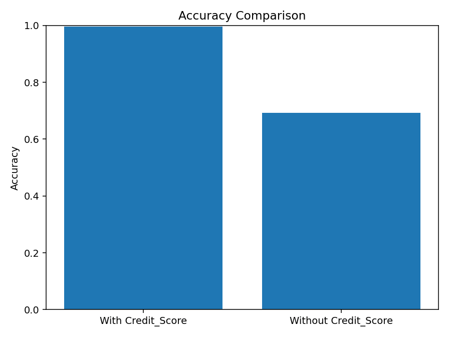
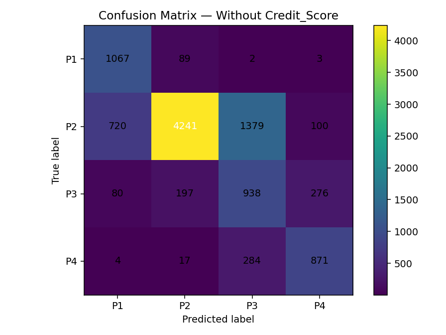
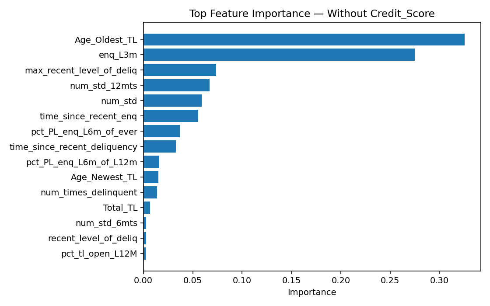

# Credit Risk Classification Machine Learning Project

Proyecto end-to-end estructurado de Machine Learning para clasificación multi-clase de aprobación crediticia, incluyendo un ablation study para evaluar la dependencia del modelo respecto a `Credit_Score`.

---

## Overview

Este proyecto implementa un pipeline reproducible de Machine Learning para predecir categorías de aprobación crediticia (`Approved_Flag`) utilizando variables financieras y comportamentales.

Se evaluaron dos escenarios experimentales:

- **With Credit_Score**
- **Without Credit_Score** (ablation study)

El objetivo no es únicamente obtener alta performance, sino analizar la influencia estructural de las variables en el proceso de aprobación.

---

## Key Insight

- Con `Credit_Score`: ~99% de accuracy  
- Sin `Credit_Score`: ~69% de accuracy  

Esto demuestra que el sistema de aprobación está fuertemente condicionado por `Credit_Score`, aunque existen señales predictivas adicionales en variables comportamentales.

---

## Methodology

- Preprocesamiento con `ColumnTransformer`  
- Imputación por mediana en variables numéricas  
- One-hot encoding en variables categóricas  
- Clasificador `Decision Tree`  
- `Stratified train-test split`  
- Análisis de `Feature Importance`  
- Comparación experimental (ablation experiment)  

---

## Project Structure
- src/ -> Pipeline de entrenamiento y evaluación
- notebooks/ -> Notebook de análisis
- reports/ -> Métricas y visualizaciones
- requirements.txt
- README.md

---

## Results

### Accuracy Comparison

### Confusion Matrix (Without Credit_Score)

### Feature Importance (Without Credit_Score)

---

## Analysis Notebook

El análisis completo y visualizaciones se encuentran en:

[View Notebook](notebooks/analysis.ipynb)

## Estado del proyecto

Finalizado.  

