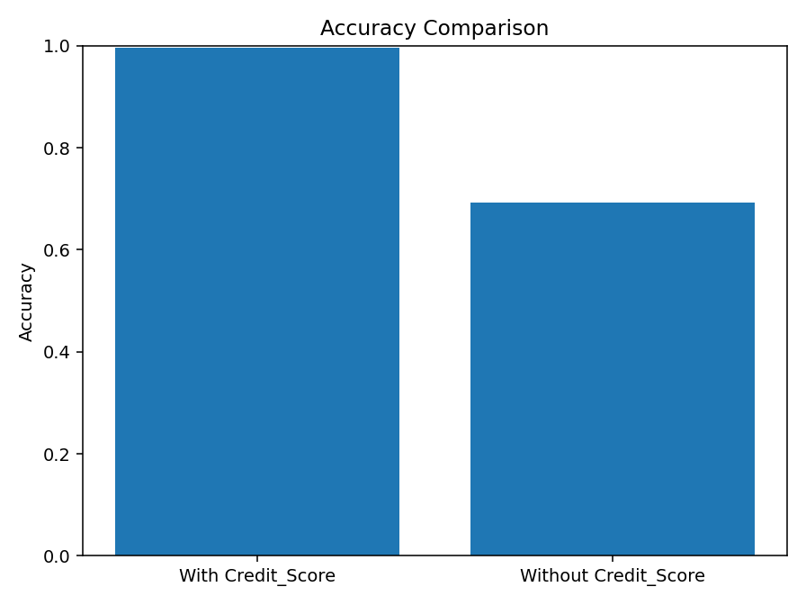
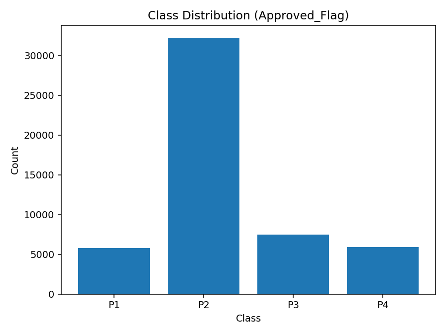
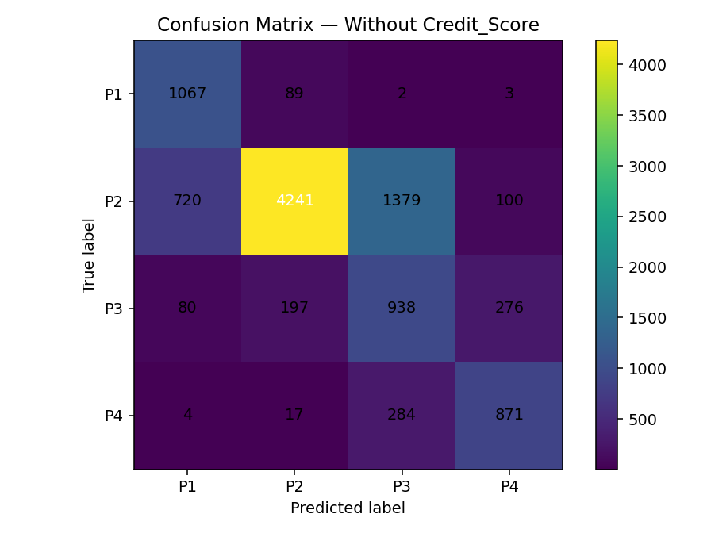
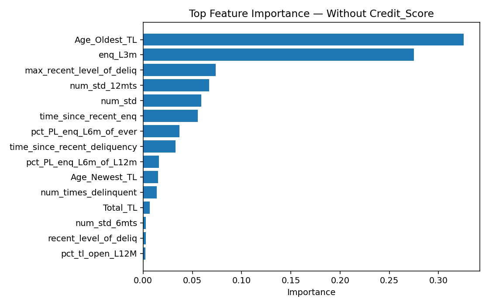

# Clasificación de Riesgo Crediticio — Machine Learning

Pipeline de Machine Learning end-to-end para clasificación multi-clase de solicitudes de crédito, con un ablation study que mide el impacto de `Credit_Score` sobre la capacidad predictiva del modelo.

---

## Contexto del problema

Las instituciones financieras clasifican solicitudes de crédito en categorías de aprobación (P1, P2, P3, P4) combinando señales financieras y comportamentales. Este proyecto construye un pipeline reproducible para entender qué variables aportan poder predictivo real y en qué medida el proceso de decisión depende de una sola variable: el score crediticio.

---

## Hallazgo principal

| Escenario | Accuracy |
|---|---|
| CON `Credit_Score` | **99.5 %** |
| SIN `Credit_Score` (ablation study) | **69.3 %** |

`Credit_Score` concentra ~99.9 % de la importancia del árbol cuando está disponible, lo que indica que el sistema de aprobación actual está prácticamente determinado por esa variable. Al excluirla, el modelo revela señales predictivas secundarias en variables de comportamiento financiero, validando la existencia de información latente independiente del score.

---

## Estructura del proyecto

```
credit-risk-classification-ml/
├── src/
│   ├── config.py          # Rutas y parámetros centralizados
│   ├── pipeline.py        # Preprocesamiento y construcción del modelo
│   ├── train.py           # Entrenamiento y exportación de artefactos
│   ├── evaluate.py        # Evaluación y métricas
│   └── predict.py         # Inferencia sobre nuevos datos
├── notebooks/
│   └── analysis.ipynb     # Análisis exploratorio y visualizaciones
├── reports/
│   ├── figures/           # Gráficos generados
│   ├── metrics_with_credit_score.txt
│   ├── metrics_without_credit_score.txt
│   ├── feature_importance_with_score.csv
│   └── feature_importance_without_score.csv
├── data/raw/              # Datasets de entrada (no incluidos, ver más abajo)
├── models/                # Modelo entrenado (generado al ejecutar el pipeline)
├── main.py                # Punto de entrada — ejecuta ambos escenarios
└── requirements.txt
```

---

## Metodología

- **Dataset**: 51 336 solicitudes · 87 variables financieras y comportamentales
- **Target**: `Approved_Flag` con 4 clases (P1, P2, P3, P4)
- **Preprocesamiento**: `ColumnTransformer` con imputación por mediana (numéricas) y one-hot encoding (categóricas)
- **Modelo**: `DecisionTreeClassifier` — `class_weight="balanced"`, `max_depth=8`, `min_samples_leaf=50`
- **Split**: Estratificado 80/20, `random_state=42`
- **Experimento**: Ablation study comparando el pipeline CON y SIN `Credit_Score`

---

## Resultados

### Comparación de accuracy



### Distribución de clases



### Matriz de confusión — SIN Credit_Score



### Importancia de variables — SIN Credit_Score



---

## Requisitos

- Python 3.9 o superior
- Dependencias declaradas en `requirements.txt`

---

## Instalación

```bash
git clone https://github.com/tu-usuario/credit-risk-classification-ml.git
cd credit-risk-classification-ml

python -m venv .venv

# Linux / macOS
source .venv/bin/activate

# Windows
.venv\Scripts\activate

pip install -r requirements.txt
```

---

## Configuración de datos

Los archivos de datos no están incluidos en el repositorio. Crea la carpeta `data/raw/` y coloca los siguientes archivos:

```
data/
└── raw/
    ├── case_study1.xlsx   # Variables financieras y comportamentales
    └── case_study2.xlsx   # Identificador y variable target (Approved_Flag)
```

---

## Ejecución

### Ejecutar ambos escenarios (recomendado)

```bash
python main.py
```

### Ejecutar un escenario específico

```bash
# CON Credit_Score
python -m src.train

# SIN Credit_Score (ablation study)
python -m src.train --no-credit-score
```

### Generar predicciones sobre nuevos datos

```bash
python -m src.predict --input data/raw/nuevos_datos.xlsx --output reports/predictions.csv
```

---

## Análisis exploratorio

El notebook `notebooks/analysis.ipynb` contiene la exploración completa: distribución de clases, entrenamiento de ambos escenarios, matrices de confusión e importancia de variables. Requiere que los datos estén configurados.

```bash
pip install jupyter
jupyter notebook notebooks/analysis.ipynb
```
